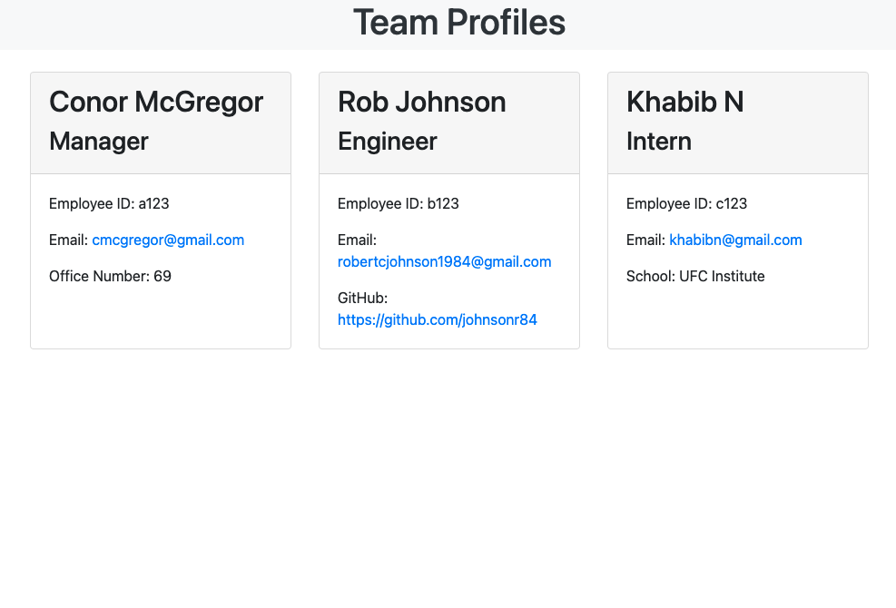

<h1 align="center"><a href=" https://johnsonr84.github.io/work-day-scheduler/">👩‍💻 Team Profile Generator 👨‍💻</a></h1>

  ## Description 
  Node.js command-line application that takes in information about employees on a software engineering team, then generates an HTML webpage that displays summaries for each person.

  [](https://github.com/johnsonr84)
  [](https://github.com/johnsonr84/readme-generator)
  [](https://github.com/johnsonr84/readme-generator)
  [](https://choosealicense.com/licenses/mit/)

## Built With
[](https://www.javascript.com/)
[](https://nodejs.org/en/)

  ## Table of Contents 
  * [Description](#Description)
  * [User Story](#UserStory)
  * [Project URL](#Project-URL)
  * [Deplyment](#Deployment)
  * [Mock-up](#Mock-up)
  * [Usage](#Usage)
  * [Credits](#Credits)
  * [License](#License)
  * [Features](#Features)
  * [Tests](#Tests)
  * [Resources](#Resources)
  * [Contact](#Contact)
  * [Author](#Author)
  #
  
   ## UserStory 
  ```
  AS A manager
  I WANT to generate a webpage that displays my team's basic info
  SO THAT I have quick access to their emails and GitHub profiles
  ```
  ## Acceptance Criteria
  ``` 
  GIVEN a command-line application that accepts user input
  WHEN I am prompted for my team members and their information
  THEN an HTML file is generated that displays a nicely formatted team roster based on user input
  WHEN I click on an email address in the HTML
  THEN my default email program opens and populates the TO field of the email with the address
  WHEN I click on the GitHub username
  THEN that GitHub profile opens in a new tab
  WHEN I start the application
  THEN I am prompted to enter the team manager’s name, employee ID, email address, and office number
  WHEN I enter the team manager’s name, employee ID, email address, and office number
  THEN I am presented with a menu with the option to add an engineer or an intern or to finish building my team
  WHEN I select the engineer option
  THEN I am prompted to enter the engineer’s name, ID, email, and GitHub username, and I am taken back to the menu
  WHEN I select the intern option
  THEN I am prompted to enter the intern’s name, ID, email, and school, and I am taken back to the menu
  WHEN I decide to finish building my team
  THEN I exit the application, and the HTML is generated
  ```
  ## Project URL
  https://github.com/johnsonr84/team-profile-generator

  ## Mock-Up
  <table>
  <tr>
     <td>demo team-profile-generator</td>
  </tr>
  <tr>
    <td></td>
  </tr>
  </table>
  <table>
    <tr>
      <td>team-profile-generator screenshot</td>
    </tr>
    <tr>
      <td></td>
  </tr>
  </table>

  ## Installation 
  To install this application, clone this repository into a folder of your choice.

  ## Usage 
  To generate the HTML for your team profile, run the index.js file in your terminal/ bash prompt and type 'node index.js'. This will initiate the prompt. Navigate the choices by using arrow keys or number keys. The generated html will be reflected in the teamHTML.js file in the src folder. 

  ## Credits 
  Another Han Solo project

  ## License 
  This project is [mit](https://choosealicense.com/licenses/mit/) licensed.

  ## Features
  Coming soon maybe 

  ## Tests
  [Jest](https://www.npmjs.com/package/jest) for running the unit tests type 'npm test' 

  ## Resources
    
  * [Inquirer](https://www.npmjs.com/package/inquirer) 
  * [Jest](https://www.npmjs.com/package/jest)
  * [Choose a License](https://choosealicense.com/)
  * [Badmath](https://img.shields.io/github/languages/top/nielsenjared/badmath)
  * [shields.io](https://shields.io/)
  * [w3schools](https://www.w3schools.com/)
  * [stackoverflow.com](https://stackoverflow.com/)
  * [10-OOP/01-28Activities]

  ## Contact
  Email: robertcjohnson1984@gmail.com 

  ## Author
  Author(s): Rob Johnson  

  GitHub: https://github.com/johnsonr84/ 